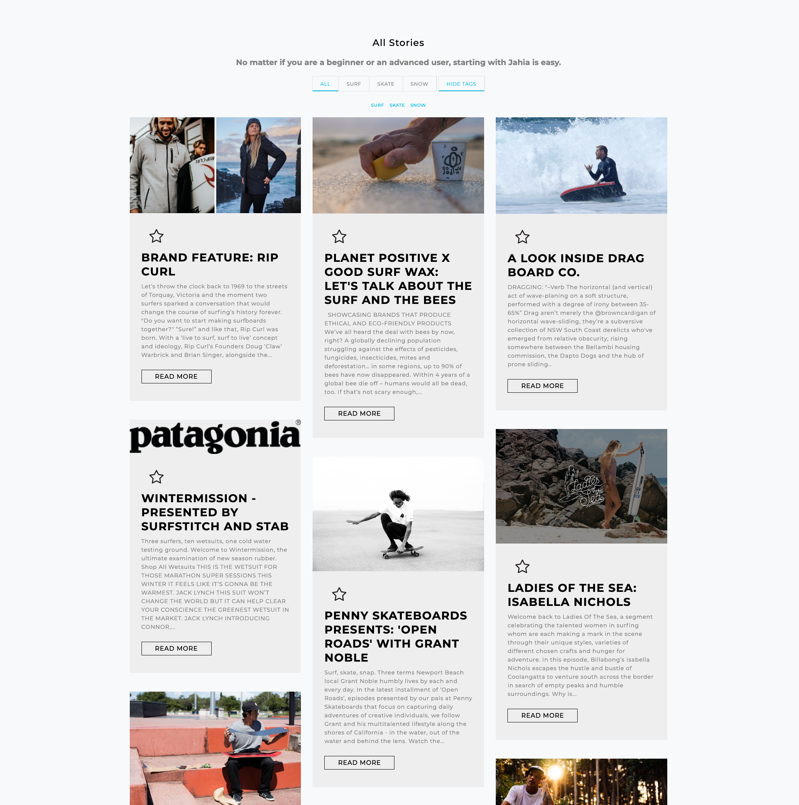
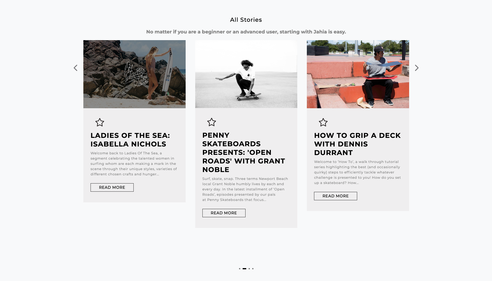

# ContentRetreivalBlock


This module is designed to retreive anytype of Content Element filtered by categories.

2 views are availables:
##Isotope view with Categories and Tags Filtering


   
   
    For Isotope filtering to be functional you need to add to your content element view 
    the Categrories and Tags as follow:
    
```JSP View    
    <jcr:nodeProperty node="${currentNode}" var="categories" name="j:defaultCategory"/>
    <jcr:nodeProperty node="${currentNode}" var="tags" name="j:tagList"/>
    
    <c:set var="myCat" value=""/>
    <c:if test="${!empty categories }">
        <c:forEach items="${categories}" var="category">
            <c:set var="myCat" value="${myCat} ${category.node.name}"/>
        </c:forEach>
    </c:if>
    <c:set var="myTags" value=""/>
    <c:if test="${!empty tags }">
        <c:forEach items="${tags}" var="tag">
            <c:set var="myTags" value="${myTags} ${tag.string}"/>
        </c:forEach>
    </c:if>
```
```html
    <div class="card ${myCat} ${myTags}">
      
      <div class="card-body">
        <h5 class="card-title">Card title</h5>
        <p class="card-text">Some quick example text to build on the card title and make up the bulk of the card's content.</p>
        <a href="#" class="btn btn-primary">Go somewhere</a>
      </div>
    </div>
```    
---
##OWL Carousel



---
###Query Parameter

1. Type of Content Element
2. Sort Criteria (Creation date or  Modification date or Publication date)
3. Sort Direction (Ascending or Descending)
4. Number of maximum results 
5. Select the starting node
6. Select Categories Filters
7. Select the Content Element View (display)
8. Select Categories to Exclude from Query
9. Select the Category to display at first page load